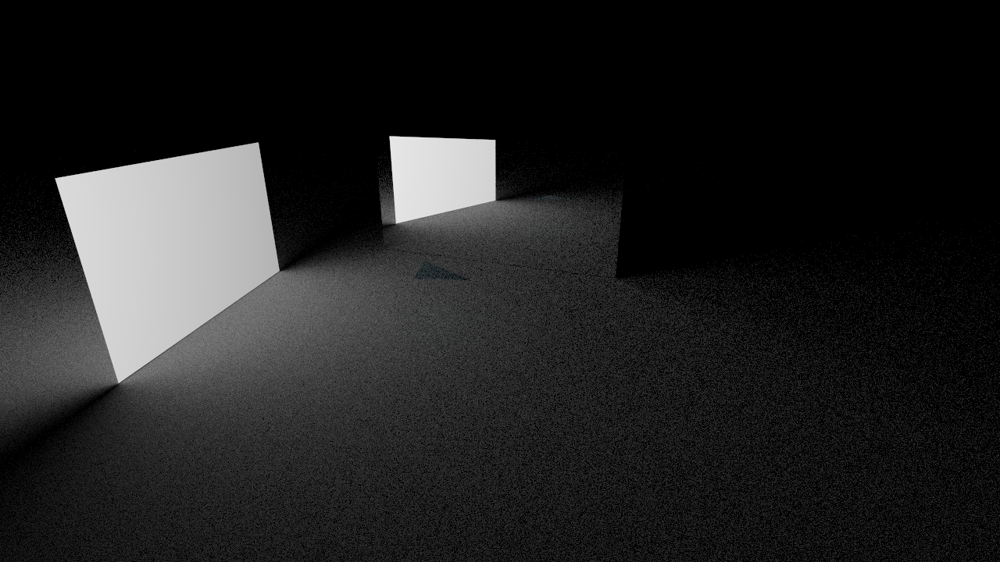
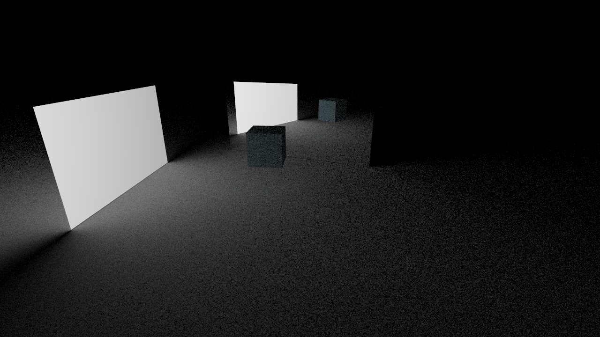

# CSC 410 Raytracer Final Project - OBJ Files
My Plan for this final project is to implement OBJ files into the raytracer.

## What is an OBJ File?
Wavefront OBJ stores 3D vector files to generate in the raytracer. 

This is explained on [Fileformat.info](https://www.fileformat.info/format/wavefrontobj/egff.htm).

To keep it simple initially, lets start with a simple obj file.

```
# Simple Wavefront file (Creates a triangle)
v 0.0 0.0 0.0
v 0.0 1.0 0.0
v 1.0 0.0 0.0
f 1 2 3
```
v refers to the points in 3d space for a face, and f describes the face with the order of the points.

### Code for Simple Wavefront file
Using this file:
```
# Simple Wavefront file (Creates a triangle)
v 0.0 0.0 0.0
v 0.0 1.0 0.0
v 1.0 0.0 0.0
f 1 2 3
```
We can set up part of the parser to create the points then create the triangle. Maybe I can make it so the amount of points on the face varies if I use a triangle object or a rectangle object.
This is what I got to work to this simple case with just a triangle:
```c++
void Parser::parse_obj(std::stringstream& ss) {
    Vector3D position;
    std::string filename, material_name;
    if (!(ss >> position >> filename >> material_name)) {
        throw std::runtime_error("Malformed obj file\nEx: (0 0 0) obj_file material_name");
    }

    const Material* material = get_material(material_name);

    std::ifstream input{filename};
    if(!input) {
        throw std::runtime_error("Cannot open obj file: " + filename);
    }

    std::string line;
    std::vector<Point3D> vertices;
    while (std::getline(input, line)) {
        std::stringstream nl(line);
        std::string command;
        nl >> command;

        if (command == "v") {
            Point3D vertex;
            double x, y, z;
            nl >> x >> y >> z;
            vertex = {x, y, z};
            vertices.push_back(vertex + position);
        }
        else if (command == "f") {
            // Access vertices and find point and that number in the vector
            std::vector<int> face;
            // Point3D input;
            int x;
            while (nl >> x) {
                face.push_back(x-1);
            }
            if (face.size() < 3) {
                throw std::runtime_error("Face must contain at least 3 vertices");
            }
            if (face.size() == 3) {
                // create a triangle
                std::unique_ptr<Object> triangle = std::make_unique<Triangle>(vertices.at(face.at(0)), vertices.at(face.at(1)),
                                                                                vertices.at(face.at(2)), material);
                world.add(std::move(triangle));
            }
        }
    }


}
```

I set this up to test in triangle.obj. When ran with an existing input file I get this image:
```
# Image made using triangles
# background textures
texture light solid (1 1 1)
texture floor solid (0.8 0.8 0.8)
# textures
texture grey solid (0.5 0.5 0.5)
texture checker checkerboard (1 0 0) (1 1 1) 16
texture skyblue solid (0.53 0.81 0.92)
# background material
material light diffuse light true
material floor lambertian floor false
# material
material checker lambertian checker false
material glass glass grey false
material reflect specular light false
material tri lambertian skyblue false
# sphere
# sphere (0 0 1) 0.5 checker
# rectangle
rectangle (-2 5 0) (4 3 0) 3 reflect
# mesh
# mesh (0 0 0) box glass
# OBJ
obj (0 0 1) triangle.obj tri
# floor
sphere (0 0 -1000) 1000 floor
# light
rectangle (-4 -2 0) (-4 3 0) 3 light
# rendering
threads 12
rays 10 100
camera (2 -8 4) (1.5 0 1) (0 0 1) 90
pixels 1280 720
output triangle.png
```



#### Cube

The next step I want to do is to create a cube, this should be 6 faces.

Extra check I have to add: Check for '/' during faces because it is a common separator instead of space, and ignoring other commands that start with v, such as vn, which is the normal.
Another check is a side with 4 points.


```c++ 
while (std::getline(input, line)) {
        std::stringstream nl(line);
        std::string command;
        nl >> command;
        if (command == "#") { // skip line
            continue;
        }

        if (command == "v") {
            Point3D vertex;
            double x, y, z;
            if (nl >> x >> y >> z) {
                vertex = {x, y, z};
                vertices.push_back(vertex + position);
            }
            // ignore other v_ commands
        }
        else if (command == "f") {
            // Access vertices and find point and that number in the vector
            std::vector<int> face;
            // Point3D input;
            std::string x;
            while (nl >> x) {
                if (x == "/") {
                    continue;
                }

                face.push_back(std::stoi(x)-1);
            }
            if (face.size() < 3) {
                throw std::runtime_error("Face must contain at least 3 vertices");
            }
            if (face.size() == 3) {
                // create a triangle
                std::unique_ptr<Object> triangle = std::make_unique<Triangle>(vertices.at(face.at(0)), vertices.at(face.at(1)),
                                                                                vertices.at(face.at(2)), material);
                world.add(std::move(triangle));
            }
            if (face.size() == 4) {
                std::unique_ptr<Object> rectangle = std::make_unique<Rectangle>(vertices.at(face.at(0)), vertices.at(face.at(1)), vertices.at(face.at(3)).x - vertices.at(face.at(2)).x, material);
                world.add(std::move(rectangle));
            }
        }
    }
}
```
This code above output this image when using the below cube object from [garykac/3d-cubes](https://github.com/garykac/3d-cubes/blob/master/cube.obj):

```
# cube.obj
# Import into Blender with Y-forward, Z-up
#
# Vertices:                        Faces:
#      f-------g                          +-------+
#     /.      /|                         /.  5   /|  3 back
#    / .     / |                        / .     / |
#   e-------h  |                   2   +-------+ 1|
#   |  b . .|. c      z          right |  . . .|. +
#   | .     | /       | /y             | . 4   | /
#   |.      |/        |/               |.      |/
#   a-------d         +---- x          +-------+
#                                           6
#                                        bottom

g cube

# Vertices
v 0.0 0.0 0.0  # 1 a
v 0.0 1.0 0.0  # 2 b
v 1.0 1.0 0.0  # 3 c
v 1.0 0.0 0.0  # 4 d
v 0.0 0.0 1.0  # 5 e
v 0.0 1.0 1.0  # 6 f
v 1.0 1.0 1.0  # 7 g
v 1.0 0.0 1.0  # 8 h

# Normal vectors
# One for each face. Shared by all vertices in that face.
vn  1.0  0.0  0.0  # 1 cghd
vn -1.0  0.0  0.0  # 2 aefb
vn  0.0  1.0  0.0  # 3 gcbf
vn  0.0 -1.0  0.0  # 4 dhea
vn  0.0  0.0  1.0  # 5 hgfe
vn  0.0  0.0 -1.0  # 6 cdab

# Faces v/vt/vn
#   3-------2
#   | -     |
#   |   #   |  Each face = 2 triangles (ccw)
#   |     - |            = 1-2-3 + 1-3-4
#   4-------1

# Face 1: cghd = cgh + chd
f 3//1 7//1 8//1
f 3//1 8//1 4//1

# Face 2: aefb = aef + afb
f 1//2 5//2 6//2
f 1//2 6//2 2//2

# Face 3: gcbf = gcb + gbf
f 7//3 3//3 2//3
f 7//3 2//3 6//3

# Face 4: dhea = dhe + dea
f 4//4 8//4 5//4
f 4//4 5//4 1//4

# Face 5: hgfe = hgf + hfe
f 8//5 7//5 6//5
f 8//5 6//5 5//5

# Face 6: cdab = cda + cab
f 3//6 4//6 1//6
f 3//6 1//6 2//6
```


To make it easier to create using the parser, I made a new constructor in the Rectangle object to take in all four corners:

```c++
Rectangle::Rectangle(const Point3D& bottom_left, const Point3D& bottom_right, const Point3D& top_left, const Point3D& top_right, const Material *material)
    :Object{material}, top{bottom_left, bottom_right, top_right, material}, bottom{top_left, top_right, bottom_left, material} {}
```

When implemented in the parser, it looks like this: 

```c++
if (face.size() == 4) {
    std::unique_ptr<Object> rectangle = std::make_unique<Rectangle>(vertices.at(face.at(0)), vertices.at(face.at(1)), vertices.at(face.at(2)), vertices.at(face.at(3)), material);
    world.add(std::move(rectangle));
}
```

And the image generates the same:



## 3D Models
This Website has many created .obj files: [Common-3d-test-models](https://github.com/alecjacobson/common-3d-test-models?tab=readme-ov-file).

