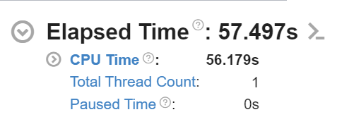

Input scene file and total runtime of rendering it
• Profiling stats showing percentage time spend in each function
random_double() is more
• Details about what code optimizations you made to improve performance
• Profiling stats for the raytracer after optimization
• Final runtime for input scene
• Summarize your results, how much of a performance gain did you achieve?

# Performance Tuning - Raytracer Project - Jonathan Abel
## Input File
```
# Test for performance
# materials
material red metallic (1 0 0) false 0.2
material light diffuse (1 1 1) true
material floor lambertian (0.8 0.8 0.8) false
material glass glass (1 1 1) false
material green lambertian (0 1 0) false
# floor
sphere (0 0 -1000) 1000 floor
# spheres
sphere (0 0 1) 1 red
sphere (2 -2 1) 1 glass
sphere (-2 0 1) 1 green
# light
sphere (0 20 1020) 1000 light
# rendering
rays 10 100
camera (4 -8 4) (0 0 1) (0 0 1) 90
pixels 1280 720
output performance.png
```
Program runs 10 ray depth and 100 samples.

Generation yields this image:


## Initial Runtime
The initial runtime with the above code was 60.566 seconds using Vtune Profiler.


## Hotspots

There are a few areas that take the most of the cpu's time in this program:
Sphere::intersect takes up most of the time, but this would make sense because it is generating the rays. The rest of the four in the above image seems like they could be optimized with better code or less usage:

1. std::uniform_real_distribution - this is mostly a lot of calls to random_double after looking into it.
2. unit - this is used throughout the program to normalize the direction of the rays, removing unnecessary unit calls will make it faster.
3. dot
4. random_double (again)

## Code Optimizations

### Unit
In this function for compute ray, I unnecessarily added a unit for the direction here when it already does that in the class.
```c++
Ray Camera::compute_ray(double s, double t) const {
    Vector3D direction = upper_left_corner + (horizontal * s) + (vertical * t) - position;
    return {position, unit(direction)};
}
```
```c++
Ray::Ray(const Point3D& origin, const Vector3D& direction)
    :origin{origin}, direction{unit(direction)} {}
```
In Vtune, it looks like this could save around 2 seconds.


Metallic might have another useless call for unit, at least if it matters if the direction is normalized before the fuzz factor is added.

```c++
Ray Metallic::scatter(const Ray& ray, const Hit& hit) const {
    Vector3D reflected = reflect(ray.direction, hit.normal);
    reflected = unit(reflected) + (fuzz * random_unit_vector());
    return Ray{hit.position, reflected};
}
```
Updated function call:
```c++
Ray Metallic::scatter(const Ray& ray, const Hit& hit) const {
    Vector3D reflected = reflect(ray.direction, hit.normal);
    reflected += fuzz * random_unit_vector();
    return Ray{hit.position, reflected};
}
```
This will probably save a little bit of time, but not much.
Each of the other ones there have necessary calls to unit in the ray constructor.

#### Runtime Test 2


As I guessed, it saved around 2 seconds.
The amount of time used by the cpu is 9.4% for Unit, but it had a slight save in Sphere::intersect.

### Dot
Checked sphere::intersect for dot usage, not much that I could cut down on.

### Random_double
To save time on Random_double, I have to find a better type of random number generator.
```c++
double random_double() {
    // static means it runs globally once
    static std::random_device rd;
    static std::mt19937 engine{rd()}; // 0
    static std::uniform_real_distribution<double> distribution{0, 1};
    return distribution(engine);
}
```

