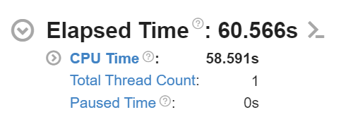
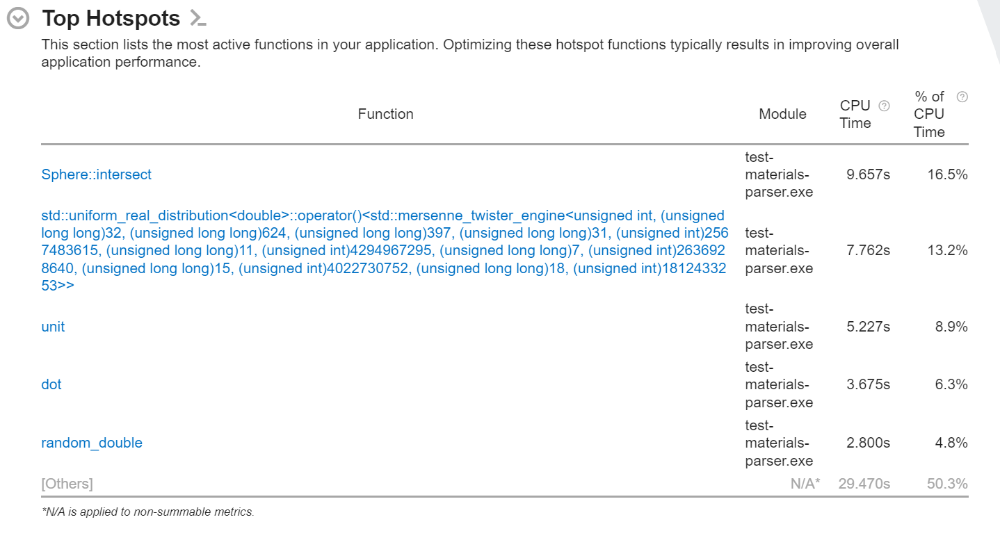
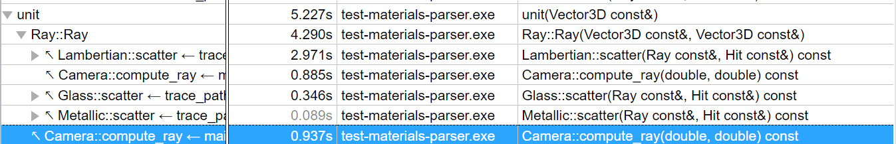
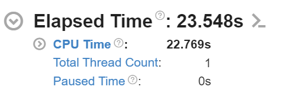

# Performance Tuning - Raytracer Project - Jonathan Abel
## Input File
```
# Test for performance
# materials
material red metallic (1 0 0) false 0.2
material light diffuse (1 1 1) true
material floor lambertian (0.8 0.8 0.8) false
material glass glass (1 1 1) false
material green lambertian (0 1 0) false
# floor
sphere (0 0 -1000) 1000 floor
# spheres
sphere (0 0 1) 1 red
sphere (2 -2 1) 1 glass
sphere (-2 0 1) 1 green
# light
sphere (0 20 1020) 1000 light
# rendering
rays 10 100
camera (4 -8 4) (0 0 1) (0 0 1) 90
pixels 1280 720
output performance.png
```
Program runs 10 ray depth and 100 samples.

Generation yields this image:


## Initial Runtime
The initial runtime with the above code was 60.566 seconds using Vtune Profiler.


## Hotspots

There are a few areas that take the most of the cpu's time in this program:
Sphere::intersect takes up most of the time, but this would make sense because it is generating the rays. The rest of the four in the above image seems like they could be optimized with better code or less usage:

1. std::uniform_real_distribution - this is mostly a lot of calls to random_double after looking into it.
2. unit - this is used throughout the program to normalize the direction of the rays, removing unnecessary unit calls will make it faster.
3. dot
4. random_double (again)

## Code Optimizations

### Unit
In this function for compute ray, I unnecessarily added a unit for the direction here when it already does that in the class.
```c++
Ray Camera::compute_ray(double s, double t) const {
    Vector3D direction = upper_left_corner + (horizontal * s) + (vertical * t) - position;
    return {position, unit(direction)};
}
```
```c++
Ray::Ray(const Point3D& origin, const Vector3D& direction)
    :origin{origin}, direction{unit(direction)} {}
```
In Vtune, it looks like this could save around 2 seconds.


Metallic might have another useless call for unit, at least if it matters if the direction is normalized before the fuzz factor is added.

```c++
Ray Metallic::scatter(const Ray& ray, const Hit& hit) const {
    Vector3D reflected = reflect(ray.direction, hit.normal);
    reflected = unit(reflected) + (fuzz * random_unit_vector());
    return Ray{hit.position, reflected};
}
```
Updated function call:
```c++
Ray Metallic::scatter(const Ray& ray, const Hit& hit) const {
    Vector3D reflected = reflect(ray.direction, hit.normal);
    reflected += fuzz * random_unit_vector();
    return Ray{hit.position, reflected};
}
```
This will probably save a little bit of time, but not much.
Each of the other ones there have necessary calls to unit in the ray constructor.

#### Runtime Test 2
With unit, it was 25.959, without the extra call, it was 21.267s.


It saved nearly 5 seconds. That is a 18% improvement.
With the revamp that we did to the file structure, I was running the wrong executable, so the real time I ran was 25.348 when units were removed.

### Dot
Checked sphere::intersect for dot usage, not much that I could cut down on.

## Sphere_intersect
```c++
std::optional<double> Sphere::intersect(const Ray& ray) const {
    // if q^2 > r^2 miss
    auto oc = center - ray.origin;
    double R = dot(ray.direction, oc);
    double q2 = dot(oc, oc) - R * R;
    double r2 = radius * radius;

    if (q2 > r2 + Constants::epsilon) {
        // std::cout << "miss!\n";
        return std::nullopt;
    }

    double h2 = r2 - q2;
    double h = std::sqrt(h2);

    if (std::abs(q2-r2) < Constants::epsilon) {
        if (R >= 0) {
            return R;
        }
    }
    // two hits straight through, return closer hit. Need to handle if it starts inside the circle.
    double hit_1 = R - h;
    double hit_2 = R + h;
    if (hit_1 >= 0) {
        return hit_1;
    }

    if (hit_2 >= 0) {
        return hit_2;
    }

    // everything is behind the ray
    return std::nullopt;
}
```
When the above code is run, this function is 17% of runtime. 63.403 seconds when going back to this code, it was probably because it was forced to do squareroot functions.
```c++
std::optional<double> Sphere::intersect(const Ray& ray) const {
    // if q^2 > r^2 miss
    auto oc = center - ray.origin;
    double R = dot(ray.direction, oc);
    double q2 = dot(oc, oc) - R * R;
    double r2 = radius * radius;

    if (q2 > r2 + Constants::epsilon) {
        // std::cout << "miss!\n";
        return std::nullopt;
    }

    double h2 = r2 - q2;
    if (h2 < 0) {
        return std::nullopt;  // No real intersections (should never happen due to the previous check)
    }
    double h = std::sqrt(h2);

    if (std::abs(q2-r2) < Constants::epsilon) {
        if (R >= 0) {
            return R;
        }
    }
    // two hits straight through, return closer hit. Need to handle if it starts inside the circle.
    double hit_1 = R - h;
    double hit_2 = R + h;
    if (hit_1 >= 0) {
        return hit_1;
    }

    if (hit_2 >= 0) {
        return hit_2;
    }

    // everything is behind the ray
    return std::nullopt;
}
```
When this code is run, the function is 16.5% of runtime, because it avoids calculating the squareroot if h2 < 0. It runs about 61.917 seconds, saving a couple seconds.

```c++
    Vector3D OC = center - ray.origin;
    double R = dot(ray.direction, OC);
    double h2 = radius*radius - dot(OC, OC) + R*R;
    if (h2 < 0) {
        return {};
    }

    double h = std::sqrt(h2);

    // time = R +/- h
    if ((R-h) > Constants::epsilon) {
        // ray intersects from outside sphere -> R-h is closer to ray origin
        // if time is positive and futher away than Epsilon
        return R-h;
    }
    else if ((R+h) > Constants::epsilon) {
        // ray intersections from inside sphere -> R+h is in the direction of the ray
        // time is positive and further away than Epsilon
        return R+h;
    }
    else {
        return {};
    }
```

This code above cuts the time to 24.092 seconds. This is about a 60 percent improvement in speed. This improves on what I wrote myself by combining math operations and avoiding calculating the squareroot at the beginning. This code runs 14.2% of the time in Sphere::intersect, which is a 3% improvement from my initial structure.

### Cmake Lists
```c++
add_compile_options(-g -Wall -Wextra -pedantic -std=c++20 -O3 -lto)
```

```c++
add_compile_options(-ggdb -Wall -Wextra -pedantic -std=c++20 -Ofast -march=native)
```
The second options above runs 24.011 seconds, which is better than the previous time from the last by almost a second, it would've made more of a difference if I didn't simplify some math first.

### Random_double
To save time on Random_double, I have to find a better type of random number generator.
```c++
double random_double() {
    // static means it runs globally once
    static std::random_device rd;
    static std::mt19937 engine{rd()}; // 0
    static std::uniform_real_distribution<double> distribution{0, 1};
    return distribution(engine);
}
```
As it is now, mersenne twister makes it so that it take about 10.4% of the runtime.

The improved version of the program using zoshiro256+.

```c++ 
uint64_t Xorshiro256::next(void) {
	const uint64_t result = s[0] + s[3];

	const uint64_t t = s[1] << 17;

	s[2] ^= s[0];
	s[3] ^= s[1];
	s[1] ^= s[2];
	s[0] ^= s[3];

	s[2] ^= t;

	s[3] = rotl(s[3], 45);

	return result;
}

uint64_t Xorshiro256::splitmix64(uint64_t *seed) {
	uint64_t z = (*seed += 0x9E3779B97F4A7C15);
	z = (z ^ (z >> 30)) * 0xBF58476D1CE4E5B9;
	z = (z ^ (z >> 27)) * 0x94D049BB133111EB;
	return z ^ (z >> 31);
}

void Xorshiro256::seed(uint64_t seed_value) {
	for (int i = 0; i < 4; i++) {
		s[i] = splitmix64(&seed_value);
	}
}

double Xorshiro256::next_double(void) {
	return (next() >> 11) * (1.0 / 9007199254740992.0); // Divide by 2^53
}
```

This code from uses some fancy math to make randomization faster, and uses splitmix64 for seeding.
This code when ran it got to 22.769, which is about a 2 second improvement. This is a 5% decrease from the previous time from the last section.

## Profiling Stats After Optimization

This final test shows that I have cut the average runtime of sphere intersect in half from the beginning of the project. Unit and random also had their own sizable chunks taken off, with random not even being in the top hotspots anymore.

## Final Runtime

The final runtime was 22.769. This is a large gain from 58 seconds.
## Performance Gain
The time from the beginning of this performance review went down nearly 40 seconds. This makes it about a 60.74% increase in performance.

